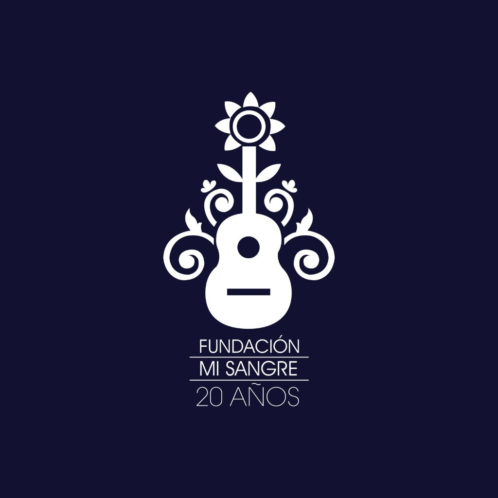
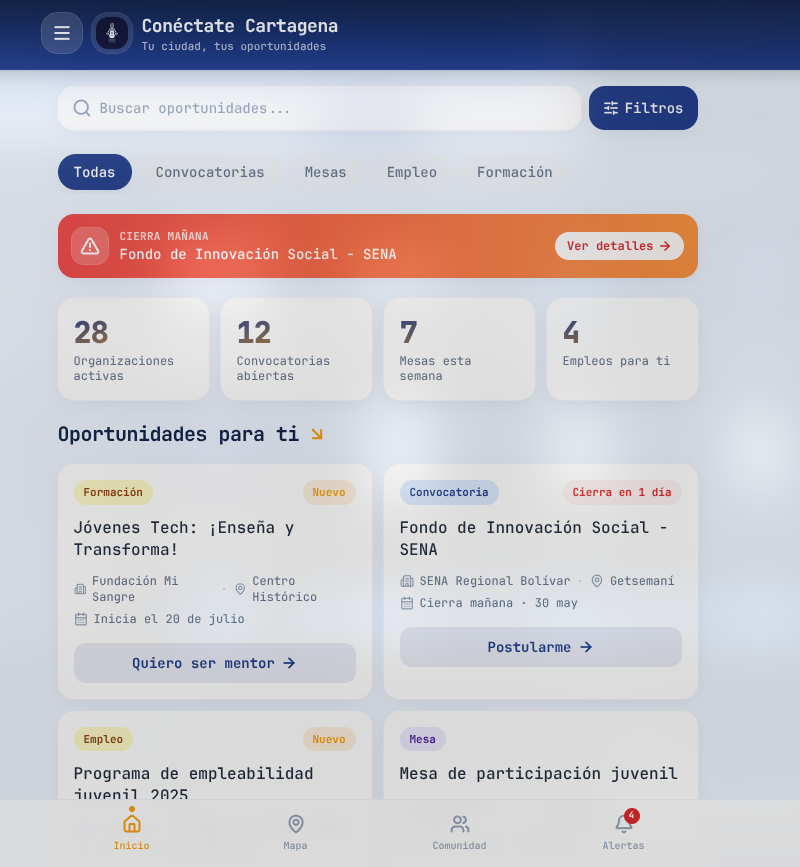
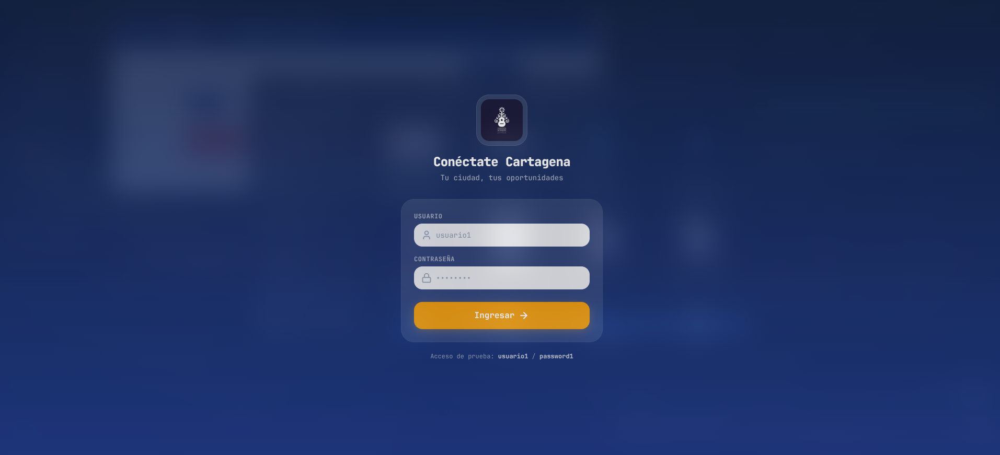
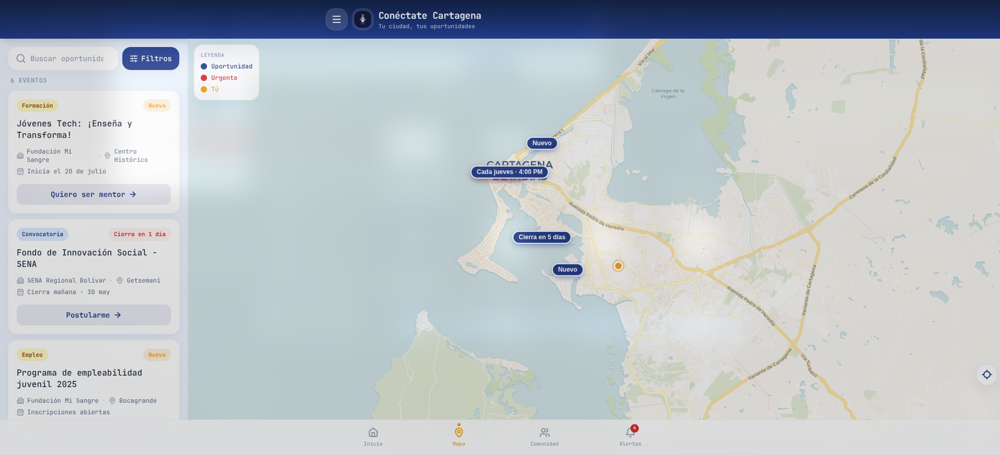
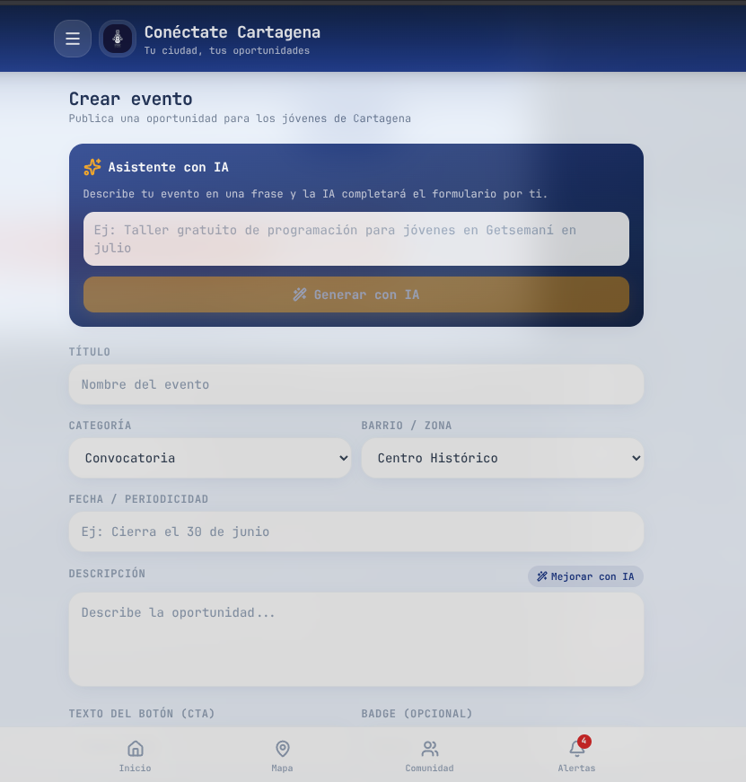
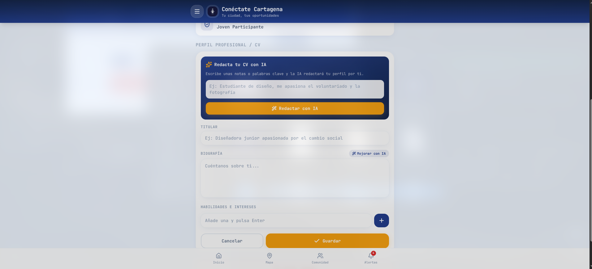

<div align="center">



# Conéctate Cartagena

### Tu ciudad, tus oportunidades 🌴

**La app mobile-first que conecta a la juventud de Cartagena con convocatorias, empleo, formación y espacios de participación — con mapa, rutas e IA.**

<br/>

[](https://react.dev)
[](https://www.typescriptlang.org)
[](https://vite.dev)
[](https://tailwindcss.com)
[](https://ai.google.dev)

<sub>🏆 Construido en un <b>Hackathon de Cursor</b></sub>

</div>

---

## ✨ ¿Qué es?

En Cartagena hay miles de jóvenes con talento y miles de oportunidades — pero **no se encuentran entre sí**. La información vive dispersa en PDFs, grupos de WhatsApp y páginas que nadie revisa.

**Conéctate Cartagena** junta a los dos en un solo lugar, en el bolsillo del joven: un feed de oportunidades, un mapa interactivo con rutas a pie y una IA que ayuda tanto a publicar convocatorias como a redactar tu CV.

---

## 📸 Vistazo

<div align="center">

### 🏠 Pantalla principal
Feed de oportunidades con búsqueda, filtros, banner de urgencia, KPIs en vivo y tarjetas accionables.



<br/><br/>

### 🔐 Inicio de sesión
Acceso limpio y enfocado, con cuentas para jóvenes y para organizaciones.



<br/><br/>

### 🗺️ Mapa interactivo
Cada oportunidad geolocalizada por barrio, con filtros, leyenda y **rutas a pie** para saber cómo llegar.



<br/><br/>

### ✨ Crear eventos con IA
Las organizaciones describen su idea en una frase y la IA completa toda la convocatoria automáticamente.



<br/><br/>

### 🤖 Perfil & CV con IA
Escribe unas palabras clave y la IA redacta tu perfil profesional por ti.



</div>

---

## 🚀 Características

| | |
| --- | --- |
| 📰 **Feed filtrable** | Convocatorias, empleo, formación y mesas, con alertas de urgencia ("cierra en 5 días"). |
| 🗺️ **Mapa con rutas** | Oportunidades geolocalizadas + rutas a pie con OpenRouteService. |
| 🏢 **Cuentas de organización** | Publica eventos y convocatorias en minutos. |
| 🤖 **IA con Gemini** | Autocompleta convocatorias desde una idea y redacta CV/perfil de los jóvenes. |
| 🔗 **Postulación directa** | Cada tarjeta enlaza a la página real de postulación. |
| 💾 **Persistencia local** | Sesión, eventos y perfiles guardados con `localStorage`. |

---

## 🛠️ Stack

**Frontend**
- ⚛️ **React 19** + **TypeScript** — UI por componentes con tipado estricto.
- ⚡ **Vite 8** — bundler y dev server con HMR.
- 🎨 **Tailwind CSS 3** — diseño mobile-first (paleta azul/verde).
- 🎬 **Framer Motion 12** — animaciones y microinteracciones.
- 🧩 **Lucide React** — iconografía.

**Mapa y geolocalización**
- 🍃 **React-Leaflet 5** + **Leaflet 1.9** — mapa interactivo.
- 🗺️ **CARTO Voyager** sobre **OpenStreetMap** — base cartográfica gratuita, sin API key.
- 🧭 **OpenRouteService** — rutas a pie y geocodificación.

**Inteligencia artificial**
- 🤖 **Google Gemini** (`gemini-2.5-flash`) — autocompletado de convocatorias y redacción de CV.

---

## ⚡ Empezar

```bash
npm install     # instalar dependencias
npm run dev     # servidor de desarrollo
npm run build   # type-check + build de producción
npm run lint    # eslint
npm run preview # previsualizar el build
```

> 💡 **Acceso de prueba:** `usuario1` / `password1`

---

## 📁 Estructura

```
src/
├── App.tsx                  # orquesta estado de filtros y búsqueda
├── types.ts                 # interfaces (Opportunity, Kpi, etc.)
├── data/opportunities.ts    # mock data (oportunidades + KPIs)
└── components/
    ├── Header.tsx           # logo + chip de ubicación
    ├── FilterPills.tsx      # barra de filtros scrolleable
    ├── SearchBar.tsx        # búsqueda + botón de filtros
    ├── UrgencyBanner.tsx    # banner de urgencia con brillo
    ├── KPISection.tsx       # KPIs con conteo animado al hacer scroll
    ├── FeedSection.tsx      # feed "Oportunidades para ti"
    ├── OpportunityCard.tsx  # tarjeta de oportunidad
    └── BottomNav.tsx        # navegación inferior
```

---

## 🎨 Paleta

| Token | Color | Uso |
| --- | --- | --- |
| `bg-body` | `#f0f7f7` | Fondo general |
| `primary` | `#0ea5e9` | CTAs, acentos, hover |
| `primary-dark` | `#0369a1` | Headers, títulos |
| `secondary` | `#10b981` | Éxito / empleo |
| `accent` | `#06b6d4` | Badges, interacciones |
| `tag-blue` | `#dbeafe` / `#1d4ed8` | Convocatorias |
| `tag-green` | `#d1fae5` / `#047857` | Empleo / Formación |
| `tag-purple` | `#ede9fe` / `#6d28d9` | Mesas |
| `tag-urgency` | `#fef2f2` / `#dc2626` | Urgencias |

---

<div align="center">

**Conéctate Cartagena** — la diferencia entre una oportunidad que se pierde y un futuro que empieza. 🚀

<sub>Hecho con 💙 para la juventud de Cartagena · Hackathon de Cursor</sub>

</div>
